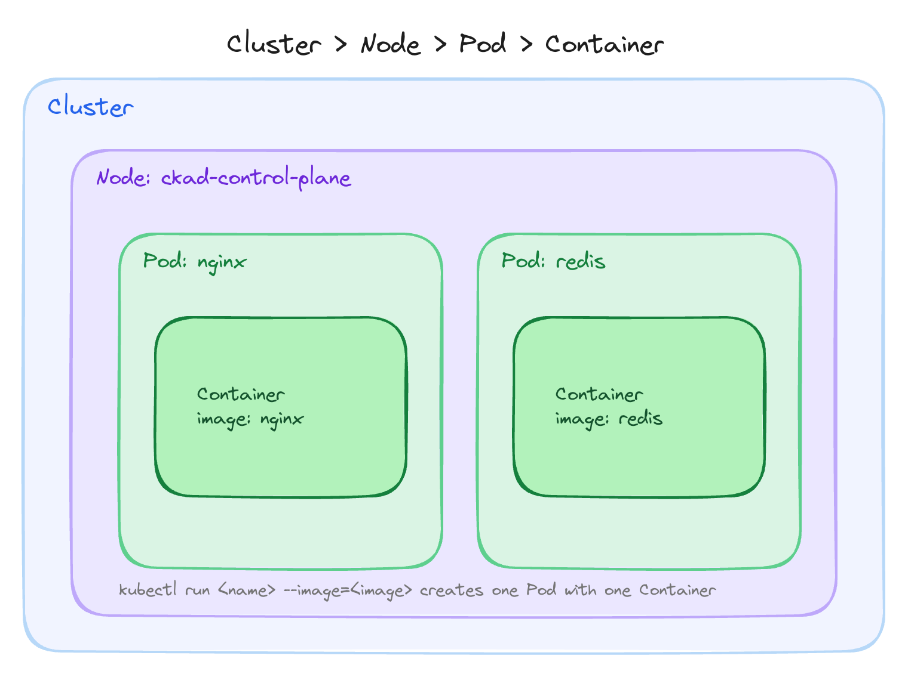
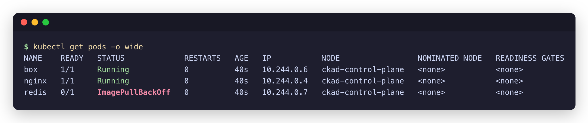
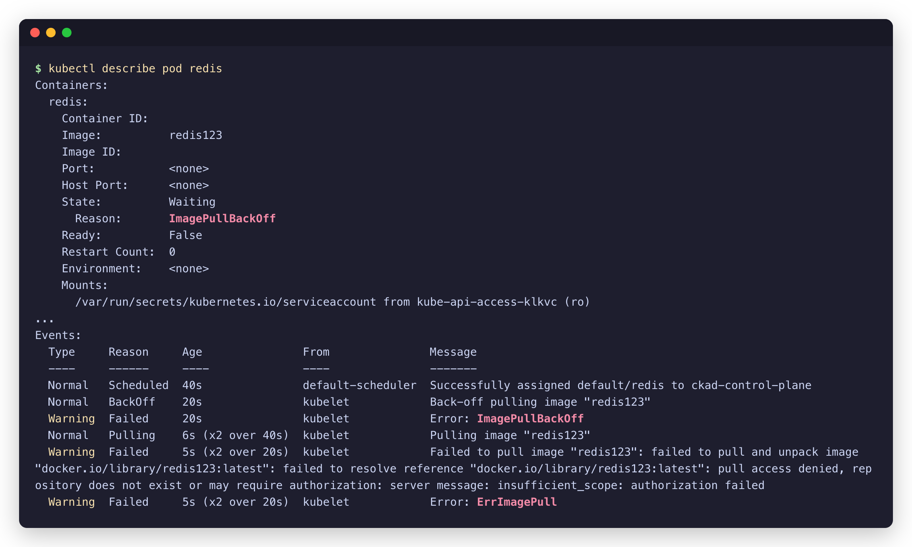
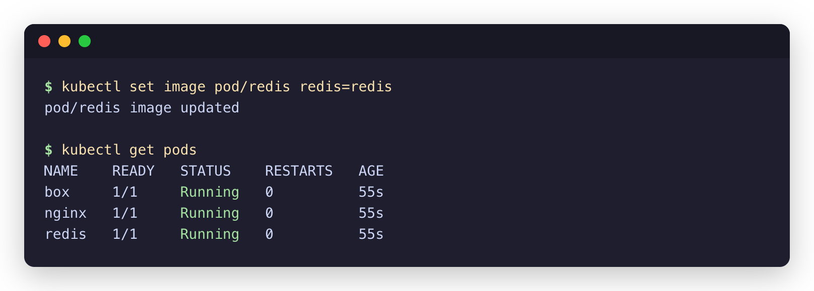

# 01 · Pods

A Pod is the smallest thing Kubernetes schedules. It wraps one or more containers and gives them a shared network and storage. Most of the time one Pod holds one container, and that is the only case this section covers.



## Create a pod

```bash
kubectl run nginx --image=nginx
```

`run` builds a Pod object named `nginx` with a single container using the `nginx` image and sends it to the API server. The scheduler picks a node, and the kubelet on that node pulls the image and starts the container.

To keep a pod alive with nothing to serve, give it a command that sleeps:

```bash
kubectl run box --image=busybox --command -- sleep 1000
```

## List pods

```bash
kubectl get pods
kubectl get pods -o wide
```

`-o wide` adds the pod IP and the node it landed on. The `READY` column is `ready containers / total containers`, so `0/1` means the pod exists but its container isn't running yet.



## Inspect a pod

```bash
kubectl describe pod redis
```

`describe` prints everything the API server knows about the pod. The two sections that answer most questions are `Containers`, which shows the image and the container state, and `Events`, which lists what the scheduler and the kubelet did, in order.

The pod below was created with `--image=redis123`, an image that doesn't exist. The kubelet tried to pull it, failed, and backed off. That is what `ImagePullBackOff` means: the pod is fine, the image name isn't.



To check only the image:

```bash
kubectl describe pod redis | grep -i image
```

## Generate YAML instead of writing it

```bash
kubectl run nginx --image=nginx --dry-run=client -o yaml > pod.yaml
kubectl create -f pod.yaml
```

`--dry-run=client` builds the object locally without sending it to the cluster. `-o yaml` prints it. The result is a valid manifest with the right field names, ready to edit. See [`pod.yaml`](pod.yaml) for what it produces.

## Change the image of a running pod

```bash
kubectl set image pod/redis redis=redis
```

The format is `pod/<pod-name> <container-name>=<new-image>`. The kubelet notices the change, pulls the new image, and restarts the container. No editor, no YAML.



The alternative is `kubectl edit pod redis`, which opens the manifest in `vi`. It works, but only if you know how to leave: `i` to insert, `Esc`, then `:wq` to save or `:q!` to abandon.

## Delete a pod

```bash
kubectl delete pod nginx
```

## Things that bite

- `kubectrl` is not a command. Aliases help: `alias k=kubectl`.
- Angle brackets in `<name>` are placeholders. Typed literally, bash reads `<` as a redirect.
- Flags need a space before them: `--image=nginx --dry-run=client`, not `--image=nginx--dry-run=client`.
- `kubectl edit` drops you in `vi`. Know `:q!` before you need it.
