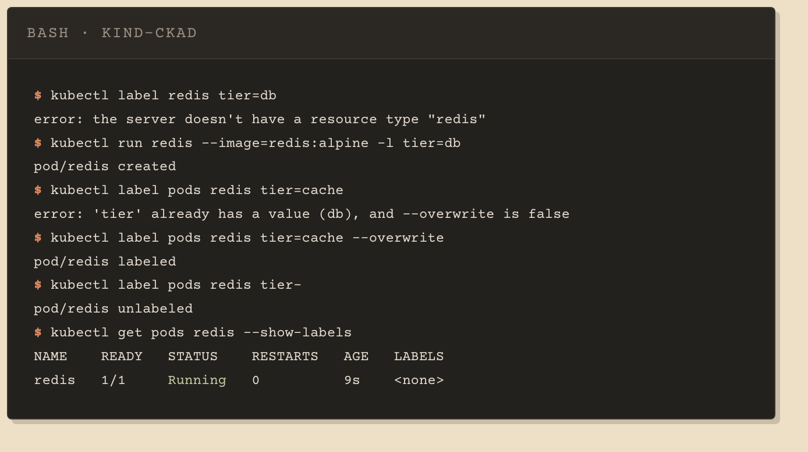
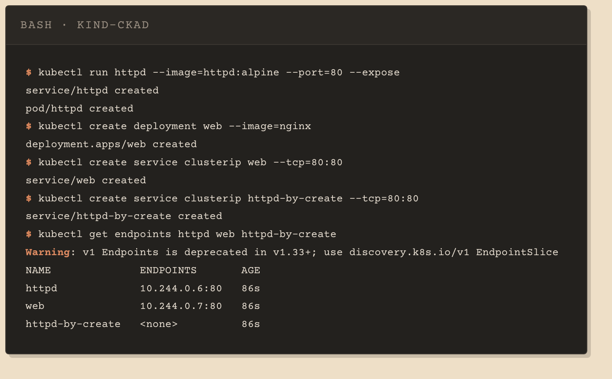
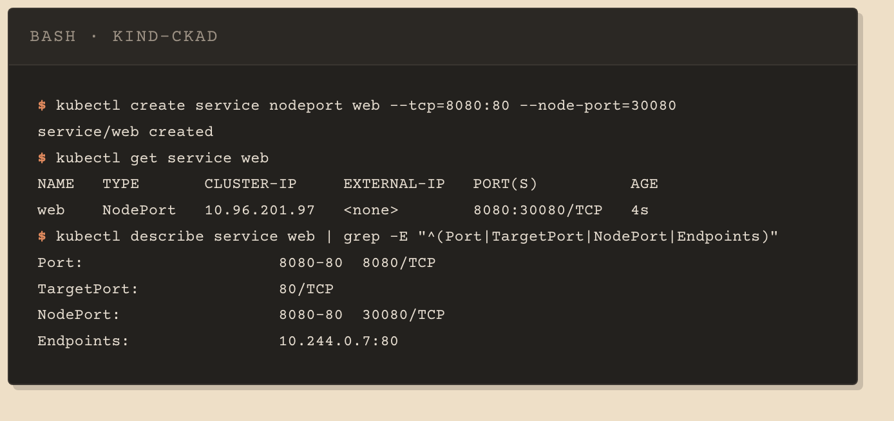

# 02 · Imperative commands and services

Part 1 covered pods. This section is about creating everything else from the command line, and about services.

Almost every `kubectl` command is three things in order: a verb, a type and a name. The type is how the API server knows which collection to look in, and leaving it out produces `error: the server doesn't have a resource type "redis"`. `run` is the exception, because it only creates pods.

## Create things without a file

```bash
kubectl run nginx --image=nginx
kubectl create deployment web --image=nginx --replicas=3
kubectl create ns dev
```

`run` creates a pod, and with `--expose` a Service alongside it. `create` has one subcommand per type: deployments, services, configmaps, secrets, jobs, namespaces, quotas. There is no `create pod` subcommand, though `kubectl create -f pod.yaml` still submits a pod manifest.

Three techniques share the word imperative, and only the first uses no file at all:

| Technique | Example |
|---|---|
| Imperative command | `kubectl run nginx --image=nginx` |
| Imperative object configuration | `kubectl create -f pod.yaml` |
| Declarative object configuration | `kubectl apply -f pod.yaml` |

`apply` creates or updates the live object to match the file. It does not watch the file, so you run it again after every edit.

## Labels

Setting a label at creation time is a flag. Setting one afterwards is a positional argument:

```bash
kubectl run redis --image=redis:alpine -l tier=db
kubectl label pods redis tier=db
```

Changing the value of an existing label is refused unless you say so, and a trailing hyphen removes one:

```bash
kubectl label pods redis tier=cache --overwrite
kubectl label pods redis tier-
```

A Service finds its pods by label and nothing else, so changing the one a selector depends on removes those pods from the Service. See [`pod-with-label.yaml`](pod-with-label.yaml).



## Expose a pod

```bash
kubectl run httpd --image=httpd:alpine --port=80 --expose
kubectl expose pod httpd --port=80 --name=httpd
```

The first creates both objects and generates matching labels and selector. The second puts a Service in front of a pod that already exists, reading the selector off that pod. Both are in [`pod-and-service.yaml`](pod-and-service.yaml).

`kubectl create service` has no selector flag at all and defaults to `app: <service-name>`. Whether that matches depends on how the pods were made:

| Command | Label it puts on the pods |
|---|---|
| `kubectl create deployment web` | `app: web` |
| `kubectl run httpd` | `run: httpd` |

So `create service clusterip web` finds the deployment's pods, and the same command would miss a pod created by `run`. When the selector matches nothing, `kubectl get endpoints <name>` returns `<none>`.



## Service types and ports

`ClusterIP` is the default and is reachable only inside the cluster. `NodePort` also opens a fixed port on every node, by default in the 30000 to 32767 range, configurable with the API server's `--service-node-port-range`.

Each port entry can carry three numbers:

```yaml
ports:
  - nodePort: 30080   # port on the node
    port: 8080        # port on the Service
    targetPort: 80    # port the container listens on
```

`nodePort` and `port` are yours to choose. `targetPort` has to be the port the application actually listens on, or the name declared for it. Point it somewhere nothing is listening and the Service is still created without error, and requests never reach anything.

The default `kubectl get services` table omits `targetPort`. Its `PORT(S)` column shows `port` plus the nodePort when allocated, as in `8080:30080/TCP`. Use `describe`, `-o yaml` or a custom output format for the rest.



## When no single command is enough

A NodePort Service with both a fixed `nodePort` and a custom selector is the usual example: `create service` takes the port but no selector, and `expose` takes the selector but has no `--node-port`. `expose --overrides` and `kubectl set selector` are file-free ways around it; generating the manifest is the one worth practising.

```bash
kubectl create service nodeport web --tcp=8080:80 --node-port=30080 --dry-run=client -o yaml > svc.yaml
# edit spec.selector so it matches the pods you want
kubectl apply -f svc.yaml
```

The generated file is [`service-nodeport.yaml`](service-nodeport.yaml).

`--dry-run=client` builds the manifest without creating anything. It suppresses the write, but it is not an offline mode: `kubectl run --dry-run=client` still contacts the API server for discovery and fails without a reachable cluster, while `create service` and `create deployment` generate fine on their own.

`--dry-run=server` is a different thing: it sends the object and lets the API server answer without persisting it. It does not catch everything a real create would, either. A NodePort outside the valid range passes server dry-run and fails on the real call:

```text
$ kubectl create service nodeport t9 --tcp=80:80 --node-port=29999
error: failed to create NodePort service: Service "t9" is invalid: spec.ports[0].nodePort:
Invalid value: 29999: provided port is not in the valid range. The range of valid ports is 30000-32767
```

## Quick reference

| Command | Creates or changes |
|---|---|
| `kubectl run NAME --image=IMG` | a pod |
| `kubectl run NAME --image=IMG --port=P --expose` | a pod and a matching Service |
| `kubectl create deployment NAME --image=IMG` | a deployment |
| `kubectl create ns NAME` | a namespace |
| `kubectl expose pod NAME --port=P` | a Service for an existing pod |
| `kubectl label TYPE NAME k=v` | adds a label |
| `kubectl label TYPE NAME k-` | removes a label |
| `kubectl set image pod/NAME C=IMG` | the image of a running container |
| `kubectl scale deployment NAME --replicas=N` | the replica count |

## Things that bite

- `kubectl create pod` is not a command. Pods belong to `run`.
- `kubectl label redis tier=db` fails: unlike `run`, `label` needs the type before the name.
- `pod/redis labeled` means the command was accepted, not that the value was right. A wrong label raises no error.
- `kubectl get` picks a few columns by default; the rest of the fields need `-o yaml` or a custom format. `get all` omits ConfigMaps, Secrets, PVCs and Ingresses entirely.
