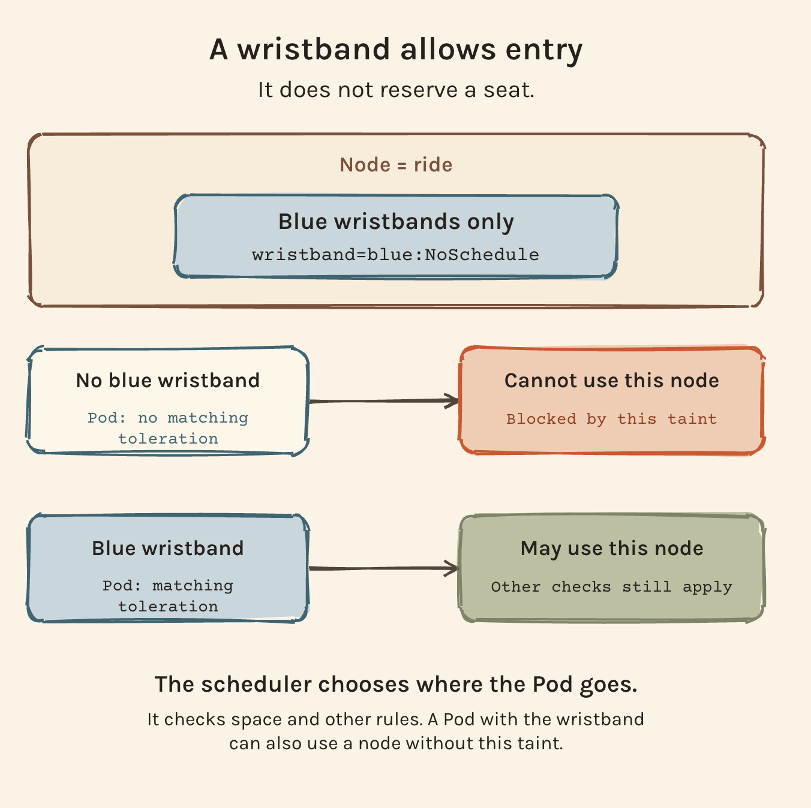
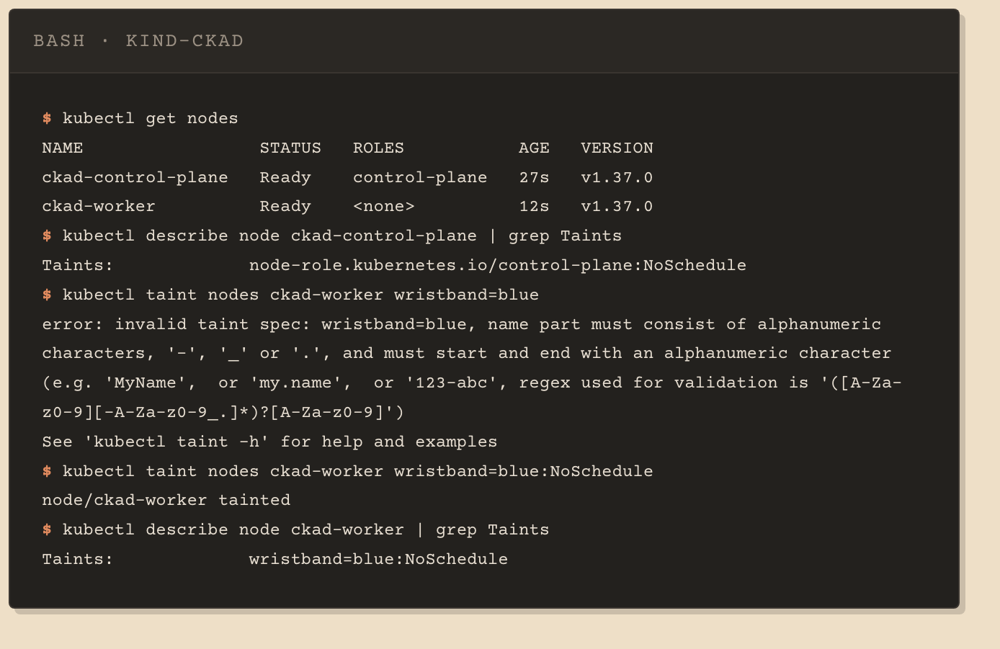
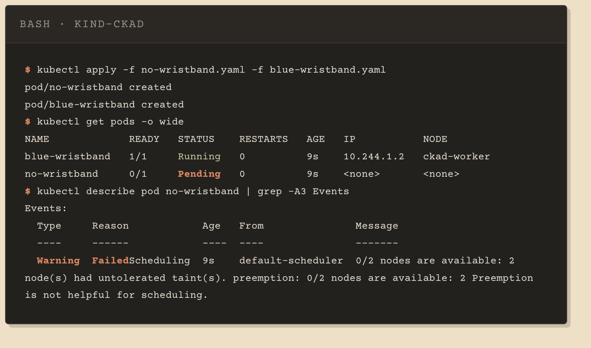
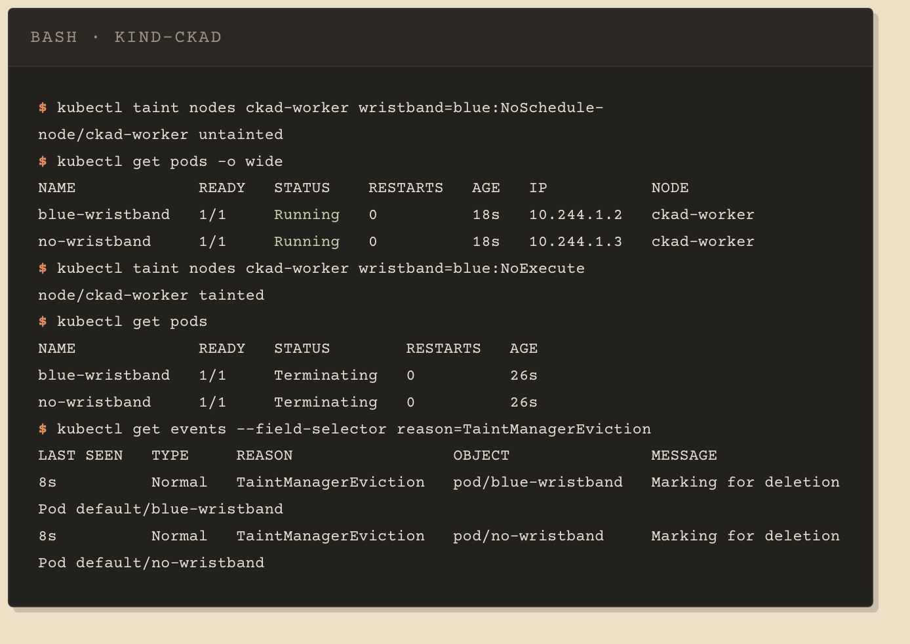
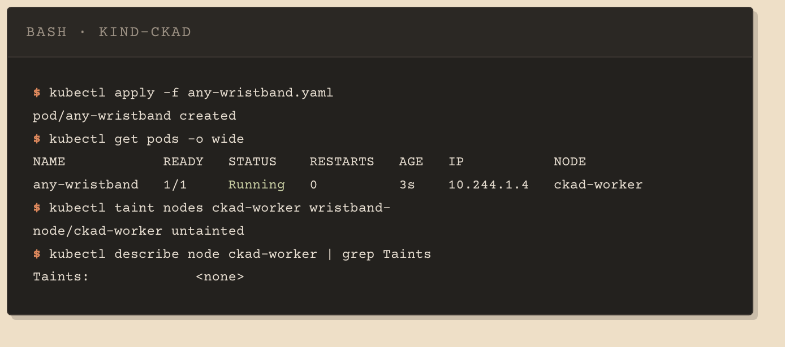

# 03 · Taints and tolerations

A taint on a node keeps pods away from it. A toleration on a pod lets that pod ignore one taint. Neither sends a pod anywhere: the scheduler still chooses the node, and a pod with a toleration can land on any node that fits.

The [blog post](https://danieldias.dev/en/blog/kubernetes-taints-and-tolerations) explains it with a theme park: the taint is a "blue wristbands only" sign on a ride, the toleration is the wristband.



This section needs a second node. [`kind.yaml`](kind.yaml) adds a worker next to the control plane:

```bash
kind create cluster --name ckad --config kind.yaml
```

## Taint a node

```bash
kubectl taint nodes ckad-worker wristband=blue:NoSchedule
kubectl describe node ckad-worker | grep Taints
```

A taint is `key=value:Effect`. The value is optional (`key:Effect`), the effect is not. Leave it out and the error is about the name, not the effect: with no colon, `kubectl` reads the whole string as the key, and `=` is not allowed in a key.

The control plane already carries `node-role.kubernetes.io/control-plane:NoSchedule`, which is why your pods go to the worker. In the single-node cluster of sections 01 and 02, kind removes that taint so pods can run somewhere.



## Tolerate it

`kubectl run` has no flag for tolerations, so generate the manifest and add them under `spec`:

```bash
kubectl run blue-wristband --image=busybox:1.37.0 --dry-run=client -o yaml --command -- sleep 3600 > blue-wristband.yaml
kubectl apply -f blue-wristband.yaml
```

```yaml
tolerations:
- effect: NoSchedule
  key: wristband
  operator: Equal
  value: blue
```

`Equal` matches when key, value and effect are all the same as the taint's. `Exists` takes no value: any taint with that key and effect matches. See [`blue-wristband.yaml`](blue-wristband.yaml) and the same pod without a toleration, [`no-wristband.yaml`](no-wristband.yaml).

## What the scheduler does



`no-wristband` stays `Pending` because every node rejects it: the worker has the wristband taint and the control plane has its own. Add a node with no taints and it would run there.

The same is true of `blue-wristband`. The toleration lets it onto the worker, it does not keep it there. To send a pod to a specific node, combine the toleration with a `nodeSelector` or node affinity.

## Effects

| Effect | New pods without a matching toleration | Pods already running |
|---|---|---|
| `PreferNoSchedule` | placed elsewhere if another node fits | stay |
| `NoSchedule` | not placed | stay |
| `NoExecute` | not placed | evicted |

Removing the `NoSchedule` taint lets `no-wristband` schedule. A `NoExecute` taint with the same key and value then evicts both pods, `blue-wristband` included, because its toleration names `NoSchedule`. The effect is part of the match.



A toleration with no `effect` matches every effect for its key. With `operator: Exists` it needs no value either, so [`any-wristband.yaml`](any-wristband.yaml) schedules and runs on the worker under the `NoExecute` taint:

```yaml
tolerations:
- key: wristband
  operator: Exists
```

On a `NoExecute` toleration, `tolerationSeconds` lets a running pod stay that many seconds before it is evicted.

## Remove a taint

Same trailing hyphen as labels in section 02:

```bash
kubectl taint nodes ckad-worker wristband=blue:NoSchedule-
kubectl taint nodes ckad-worker wristband-
```

The first removes one taint. The second removes every taint with the key `wristband`, whatever its value and effect.



## Quick reference

| Command | Does |
|---|---|
| `kubectl taint nodes NODE k=v:Effect` | adds a taint |
| `kubectl taint nodes NODE k=v:Effect-` | removes that taint |
| `kubectl taint nodes NODE k-` | removes every taint with key `k` |
| `kubectl describe node NODE \| grep -A2 Taints` | lists the node's taints |
| `kubectl get pods -o wide` | shows the node each pod landed on |
| `kubectl describe pod NAME` | shows `FailedScheduling` and the reason |

## Things that bite

- `kubectl taint nodes ckad-worker wristband=blue` fails with a message about the name part. The missing piece is the effect.
- `describe node | grep Taints` prints only the first taint. The others are on the following lines, so use `grep -A` or `kubectl get node NODE -o jsonpath='{.spec.taints}'`.
- A toleration is permission, not placement. A pod that tolerates the taint can still run on any other node.
- A `NoSchedule` toleration does not protect a pod from a `NoExecute` taint with the same key and value.
- `NoExecute` evicts pods that are already running. A bare pod is deleted, not moved: nothing recreates it.
